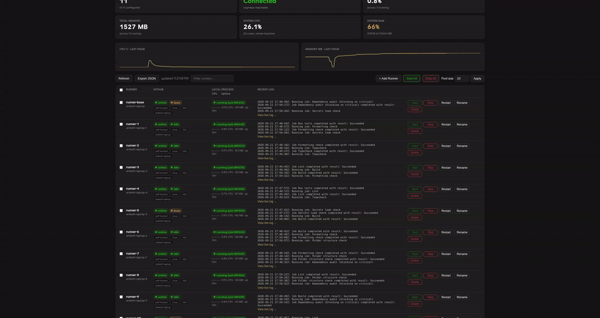
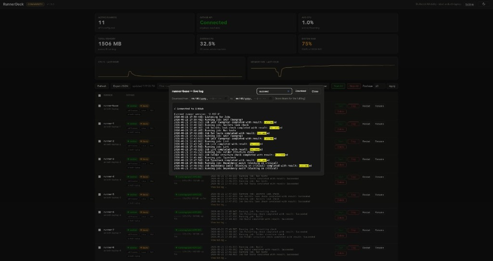

<div align="center">


# RunnerDeck

**One dashboard for every self-hosted GitHub Actions runner on your machine.**

[](https://github.com/AnikethTS/RunnerDeck/actions/workflows/ci.yml)
[](https://github.com/AnikethTS/RunnerDeck/releases/latest)
[](https://scorecard.dev/viewer/?uri=github.com/AnikethTS/RunnerDeck)
[](LICENSE)

[](composer.json)
[](public/assets/js)
[](docs/how-it-works.md)
[](docs/docker.md)



</div>

See which runners are online, busy, or quietly dead. Tail their logs live.
Start, stop, or restart them — one at a time or all together — from a
button instead of a pidfile and an SSH session.

No framework, no build step, no dependencies to run it. Just PHP and a
little vanilla JS.

## Quick start

```bash
git clone https://github.com/AnikethTS/RunnerDeck.git && cd RunnerDeck
./run.sh                # binds 127.0.0.1:8090, no .env required
```

Open `http://127.0.0.1:8090/`, pick org or repo scope, click **Start All**.
That's the whole setup. Machine not ready yet? Run `php bin/doctor.php` to
check — or see [Getting started](docs/getting-started.md) for the full
walkthrough, prerequisites, and platform notes (Linux/macOS native,
Windows via WSL2).

## Screenshots

| Dashboard | Live log |
|---|---|
|  |  |

| Add runner | Settings |
|---|---|
|  |  |

## Why this exists

Self-hosted runners are cheap to run many of on one machine, but tedious to
operate: is `runner-7` actually alive, or did its process die three hours ago
while GitHub still shows it "busy"? Which of these logs has the failure? Did
that last "Start All" click actually work, or did it just pile up a second
copy on top of the first? RunnerDeck exists to make those questions fast
to answer, and to make starting/stopping a fleet of runners a button instead
of a script incantation.

## What it does

- Checks each runner two ways — what GitHub reports, and what's actually
  running on this machine — and flags the two when they disagree.
- Adds, starts, stops, renames, and deletes runners for you, checksums and
  all. No more downloading the runner package and running `config.sh` by hand.
- Shows live CPU/RAM per runner and for the whole machine, plus a rolling
  history chart.
- Can auto-restart a runner that crashes, with crash-loop protection so it
  doesn't retry forever.
- Has a full JSON API behind the UI, documented in [API.md](API.md), if
  you'd rather script it.

Curious exactly how any of that works under the hood? See
[How it works](docs/how-it-works.md) for the full behavior reference.

## Docs

- [Getting started](docs/getting-started.md) — prerequisites, platform
  support, first-time setup, Add to Home Screen
- [How it works](docs/how-it-works.md) — the full behavior reference
- [Docker](docs/docker.md) — running RunnerDeck in a container (or Podman)
- [Configuration](docs/configuration.md) — every environment variable
- [Security & safety](docs/security-and-safety.md) — hosting remotely,
  what this trusts, what it doesn't
- [Development](docs/development.md) — running tests, CI, directory layout
- [API.md](API.md) — the JSON API this UI is itself a client of
- [CONTRIBUTING.md](CONTRIBUTING.md) — how to send a PR
- [SECURITY.md](SECURITY.md) — how to report a vulnerability

## Contributors

<a href="https://github.com/AnikethTS/RunnerDeck/graphs/contributors">
  
</a>

## License

MIT — see [LICENSE](LICENSE).
