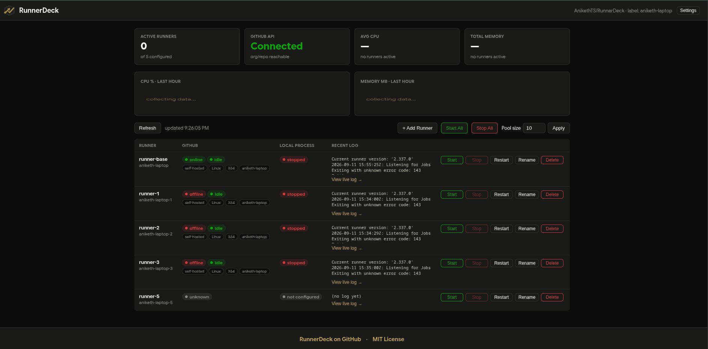
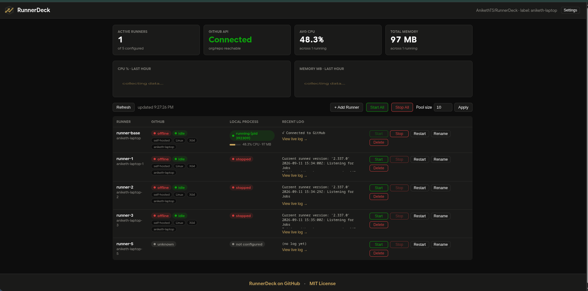
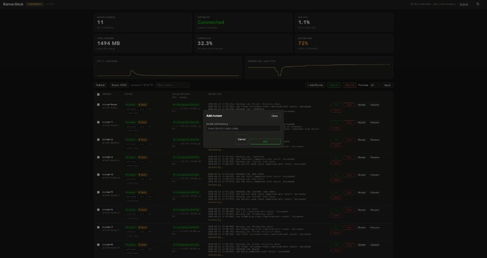
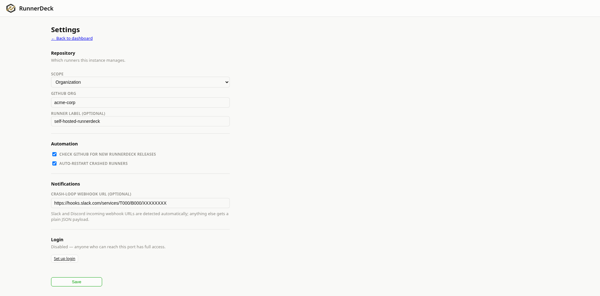

# RunnerDeck

[](https://github.com/AnikethTS/RunnerDeck/actions/workflows/ci.yml)
[](https://github.com/AnikethTS/RunnerDeck/releases/latest)

A small, local-only web UI for managing a pool of self-hosted GitHub Actions
runners on a single machine: see their GitHub-reported status (online/offline,
busy/idle), see whether the local process is actually running, tail their
logs live, and start/stop/restart them — individually or all at once —
without hand-editing pidfiles or SSHing in to run `ps aux | grep`.

Plain PHP, no framework, no build step, no Composer dependencies. A bit of
vanilla JS for auto-refresh and live log tailing. That's it.

## Screenshots

| Dashboard | Running |
|---|---|
|  |  |

| Add runner | Settings |
|---|---|
|  |  |

## Why this exists

Self-hosted runners are cheap to run many of on one machine, but tedious to
operate: is `runner-7` actually alive, or did its process die three hours ago
while GitHub still shows it "busy"? Which of these logs has the failure? Did
that last "Start All" click actually work, or did it just pile up a second
copy on top of the first? RunnerDeck exists to make those questions fast
to answer, and to make starting/stopping a fleet of runners a button instead
of a script incantation.

## How it works

- **Local process state** comes from reading each runner directory directly
  — its `.runner` config, its `runner.pid` file, and (as a fallback, since
  pidfiles can go stale or get lost) a live scan of `/proc` matching on the
  actual `Runner.Listener` executable path. A runner is never silently
  "invisible" just because its pidfile disappeared.
- **GitHub-reported state** comes from `gh api orgs/<org>/actions/runners`.
- **Starting an unconfigured runner slot** downloads the official runner
  package for this machine's OS/arch (via the same
  `orgs/.../actions/runners/downloads` endpoint GitHub's own "Add new
  runner" page uses), verifies its checksum, extracts it, requests a fresh
  org registration token, and runs `config.sh` — the same flow you'd do by
  hand, done for you. No manual pre-setup step.
- **Stopping** sends `SIGTERM` to the actual process (by pidfile, or by the
  `/proc` fallback if the pidfile is missing) and waits for a graceful exit.
- Before any **Stop**, the dashboard checks GitHub's `busy` flag for that
  runner and asks for confirmation if it's mid-job (or if that status can't
  be verified at all — it fails closed, not open).
- **Add Runner** allocates the next free slot and lets you give it its own
  GitHub-registered name. **Rename** stops a runner, deregisters it from
  GitHub, and re-registers it fresh under the new name — same busy-flag
  confirmation as Stop, since it interrupts any in-progress job. **Delete**
  does the same deregistration and then permanently removes the runner's
  local directory (binaries, config, logs) — always confirmed separately
  from the busy check, since there's no undo.
- Each running runner's **CPU%/RAM/uptime** is shown live (`ps`-based,
  cross-platform, read-only — nothing is capped or throttled), with a
  rolling one-hour pool-wide history chart backed by a small local SQLite
  file (`storage/history.sqlite`). This is best-effort: if the `pdo_sqlite`
  PHP extension isn't installed, the rest of the dashboard works exactly
  the same, you just don't get the chart.
- A **filter box** narrows the table by runner ID or registered name, and
  each runner's log can be **downloaded in full**, not just tailed.
- If a runner's local process state and its GitHub-reported state
  **disagree for several polls in a row**, the row is flagged — a one-off
  mismatch during a status transition is normal and ignored, a persistent
  one usually means the process died without GitHub finding out yet (or
  vice versa).
- An optional **auto-restart** toggle brings a runner back up if its
  process dies without you having stopped it yourself. It backs off after
  a few failed attempts in a row (crash-looping is flagged, not retried
  forever) and resets once the runner has stayed healthy for a couple of
  minutes.
- Runners can be **selected in bulk** (checkboxes, with a "select all" for
  the current filter) and started, stopped, or deleted together — the busy
  check for Stop/Delete is done once for the whole selection, not per runner.

## Platform support

This means modern versions of Linux/macOS/Windows — not "every version ever
shipped." Be specific about what that means before assuming an old box works:

| Platform | Support | Notes |
|---|---|---|
| Linux | Native | Needs `bash` (not just `sh`) and PHP 8.1+ with `posix`/`pcntl`. CI tests `ubuntu-latest` and `ubuntu-22.04` on glibc, plus a dedicated Alpine (musl) smoke test — Alpine doesn't ship `bash` by default, which is the one concrete distro gap this project has, and it's verified in CI rather than just claimed. Distros whose default PHP package is older than 8.1 need a backport/PPA. Process liveness uses `/proc`. |
| macOS | Native | Getting PHP 8.1+ in practice means Homebrew, which drops support for old macOS releases on a rolling basis — that's the real version floor, not anything in this codebase. CI tests `macos-latest` and `macos-14`. Process liveness falls back to `ps`/`lsof` (no `/proc` on Darwin). |
| Windows | Via WSL2 | Run `.\run.ps1` — it forwards into WSL and runs `run.sh` there, so it inherits the Linux support above (WSL2 *is* a real Linux kernel). Requires **Windows 10 build 2004 (May 2020 update, 19041) or later, or Windows 11** — that's WSL2's own minimum, not something this project adds. There is no native-Windows code path and no WSL1 fallback: this app depends on `posix_kill`/`pcntl` (`SIGTERM`) for stopping runner processes, PHP does not ship those extensions on Windows, and WSL1 has no real Linux kernel for `/proc` to work the way this app expects. |

## Prerequisites

- **PHP CLI 8.1+** with the `posix` extension (process liveness checks) and
  `pcntl` (signal constants). Both are standard in most distro `php-cli`
  packages. On Windows, install these inside WSL2, not on the Windows side.
  - Debian/Ubuntu (incl. WSL2): `apt install php-cli`
  - Fedora: `dnf install php-cli php-process`
  - macOS (Homebrew): `brew install php`
  - Windows: `wsl --install`, then follow the Debian/Ubuntu instructions
    inside the WSL2 shell.
- **Optional:** the `pdo_sqlite` extension, for the CPU/RAM history chart
  (`apt install php-sqlite3` / `dnf install php-pdo` / bundled with
  Homebrew's `php`). Nothing else in the dashboard depends on it.
- **[`gh`](https://cli.github.com/)**, authenticated (`gh auth login`), with
  access matching the scope you pick (see `RUNNERDECK_SCOPE` below). GitHub's
  API has no concept of a personal-account-level runner — it's org or repo:
  - **Org scope** (default) — you need **admin access to the GitHub org**
    you're registering runners under, and a token with the `admin:org`
    scope: `gh auth refresh -h github.com -s admin:org`.
  - **Repo scope** — no org needed, runners are scoped to (and only run
    jobs from) one repo you're an admin of, which you are by default for
    repos you own. Needs the `repo` scope, which `gh auth login`'s default
    scopes already include — nothing extra to request in the common case.
- `curl` and `tar` (or `unzip` on Windows) for downloading and extracting
  the runner package — both are standard on Linux/macOS.

Not sure if your machine meets all of the above? Run:

```bash
php bin/doctor.php
```

It checks the PHP version and extensions, `bash`/`curl`/`tar`, whether `gh`
is installed and authenticated, whether the configured scope can actually
read runners, and whether the pool and storage directories are writable —
and exits non-zero if anything required is missing, so it's safe to use in
a setup script too.

## First-time setup

1. **Run it** — no `.env` required to get started:

   ```bash
   ./run.sh          # binds 127.0.0.1:8090
   ./run.sh 9000     # or pick your own port
   ```

   On Windows, run this from PowerShell instead (see [Platform
   support](#platform-support)):

   ```powershell
   .\run.ps1
   .\run.ps1 -Port 9000
   ```

2. **Open `http://127.0.0.1:8090/`.** If nothing's configured yet, you'll
   land on a setup screen: pick org scope (needs a GitHub org you admin) or
   repo scope (needs a repo you own), fill in the org or `owner/repo`, and
   save — no restart needed. Change it later anytime from the **Settings**
   button in the header. This is saved to a small local, gitignored file
   (`storage/settings.json`), not `.env`.

3. Click **Start All** (or set a **Pool size** and **Apply**). Everything —
   downloading the runner binaries, registering with GitHub, and launching
   the processes — happens from there. No manual runner setup required.

Prefer config files over the UI (e.g. for a scripted/systemd deployment)?
Copy `.env.example` to `.env` and fill it in instead — real environment
variables win over `.env`, which wins over anything saved through the UI,
so this is always available as an override.

## Configuration

Three layers, highest priority first: **real environment variables** (e.g.
a systemd unit's `Environment=`) → **`.env`** (see `.env.example`) →
**settings saved through the UI** (`storage/settings.json`). You only need
one of these — most people will just use the in-app setup screen:

| Variable | Required | Default | Meaning |
|---|---|---|---|
| `RUNNERDECK_SCOPE` | no | `org` | `org` to manage org-level runners, or `repo` to scope runners to a single repo instead |
| `RUNNERDECK_ORG` | only if `scope=org` | — | GitHub org the runners belong to |
| `RUNNERDECK_REPO` | only if `scope=repo` | — | `owner/repo` the runners belong to |
| `RUNNERDECK_LABEL` | no | `self-hosted-runnerdeck` | Shared label across the pool; also `runner-base`'s own registered name |
| `RUNNERDECK_POOL_DIR` | no | `<repo>/../runners` | Where `runner-base`, `runner-1`, ... live |
| `RUNNERDECK_GH_BIN` | no | auto-detected | Explicit path to `gh`, if it's not resolvable from PATH in whatever context launches `run.sh` |

Optional: drop a `public/assets/logo.png` in to show a logo in the header —
it's gitignored and entirely optional, the dashboard works fine without one.

## Directory layout

```
runnerdeck/
  public/
    index.php       server-rendered dashboard page
    api.php         JSON API (status, start/stop/restart, pool resize)
    log_stream.php  Server-Sent Events log tailing
    assets/         app.js, style.css, optional logo.png
  src/
    bootstrap.php        single load point required by every public/*.php
    Config.php           env-based configuration
    Settings.php          reads/writes storage/settings.json (UI setup/Settings)
    History.php            best-effort CPU/RAM history in storage/history.sqlite
    Csrf.php              session-bound CSRF token minting/verification
    RunnerPool.php        discovers runner dirs, checks process liveness
    GithubClient.php      shells out to `gh`
    Provisioner.php       downloads, installs, and registers a runner
    ProcessControl.php    start/stop/restart, individual and pool-wide
    Dashboard.php         merges local + GitHub state into one snapshot
    Shell.php             timeout-guarded subprocess helper
  tests/            PHPUnit unit tests for the pure-logic pieces above
  .githooks/        pre-commit hook (cs/stan/test), wired up by `composer install`
  deploy/           optional process-supervision examples (systemd, launchd)
  run.sh            Linux/macOS entry point
  run.ps1           Windows entry point (forwards into WSL2)
```

## Development

Running the app itself needs nothing but PHP — `./run.sh` works with a bare
checkout, no build step, no `composer install`. Composer is only used for
**dev tooling** (tests, static analysis, lint):

```bash
composer install          # pulls in phpunit, phpstan, phpcs (dev-only)
composer run test          # PHPUnit
composer run stan          # phpstan (level 5)
composer run cs            # phpcs, PSR-12
composer run cs-fix        # phpcbf, auto-fixes what it can
composer audit             # known CVEs in dependencies
```

`composer install` also points git at `.githooks/` (a plain shell
pre-commit hook, no Node/Husky involved), so every commit runs `phpcs`,
`phpstan`, and the test suite before it's allowed through. If you already
had `vendor/` installed before this hook existed, wire it up once with
`composer run hooks-install`. A commit made without dev tooling installed
skips the checks with a warning rather than blocking you.

The JS/CSS side has its own dev-only tooling, the same "never a runtime
dependency" deal as Composer above — `run.sh` doesn't need `node_modules/`
any more than it needs `vendor/`:

```bash
npm install       # pulls in eslint, stylelint, Playwright (dev-only)
npm run lint:js   # eslint on public/assets/app.js
npm run lint:css  # stylelint on public/assets/style.css
npm run e2e       # Playwright — see e2e/dashboard.spec.js
```

`npm run e2e` boots a real `php -S` server and drives the real dashboard in
a real (headless) browser — see the comment at the top of
`e2e/dashboard.spec.js` for exactly what is and isn't real in there (GitHub
itself is never contacted; runner data for the richer UI tests is supplied
by mocking `action=status` responses).

CI (`.github/workflows/ci.yml`) runs all of the above plus a boot smoke test
across `ubuntu-latest`, `ubuntu-22.04`, `macos-latest`, `macos-14`, and a
dedicated Alpine (musl) container for every push/PR — see [Platform
support](#platform-support) — with the default `GITHUB_TOKEN` restricted
to read-only and third-party actions pinned to commit SHAs rather than
mutable version tags. `.github/workflows/release.yml` publishes
a zipped GitHub Release whenever a `vX.Y.Z` tag is pushed. Dependabot
(`.github/dependabot.yml`) keeps the dev-tooling Composer and npm
dependencies and the pinned Actions SHAs current on a weekly schedule.

Security checks beyond linting: `.github/workflows/semgrep.yml` runs a
static analysis pass (`p/security-audit` + `p/php` rulesets) on every
push/PR; `.github/workflows/dependency-review.yml` blocks a PR that
introduces a known-vulnerable or newly license-incompatible dependency;
GitHub secret scanning + push protection and Dependabot security updates
are both enabled on the repo itself (not something in this codebase to
configure, but worth knowing they're on).

Want to contribute? See [CONTRIBUTING.md](CONTRIBUTING.md) — it covers PR
expectations and the project's policy on AI-assisted contributions.

## Safety notes

This is built for a **single-user, single-machine, localhost-only** setup —
`run.sh` binds `127.0.0.1` deliberately and that should not be changed. The
backend shells out to `gh` with whatever scope your login token has (real
admin access to your org's runners in org scope, or to that one repo's
runners in repo scope), and it can start and stop real processes on the
machine it runs on. Don't put this behind a reverse proxy or expose the
port on any network interface beyond loopback. It also downloads and
executes GitHub's official
runner package on first use of each runner slot — the same binary GitHub's
own setup page would have you download by hand, checksum-verified before
extraction.

All state-changing API calls (`start`, `stop`, `restart`, `start_all`,
`stop_all`, `resize`) require a session-bound CSRF token minted by
`index.php` and sent back by `assets/app.js` — this stops a malicious page
open in another tab from silently driving the dashboard, but it is not a
substitute for keeping this off any network beyond loopback.

## License

MIT — see `LICENSE`.
